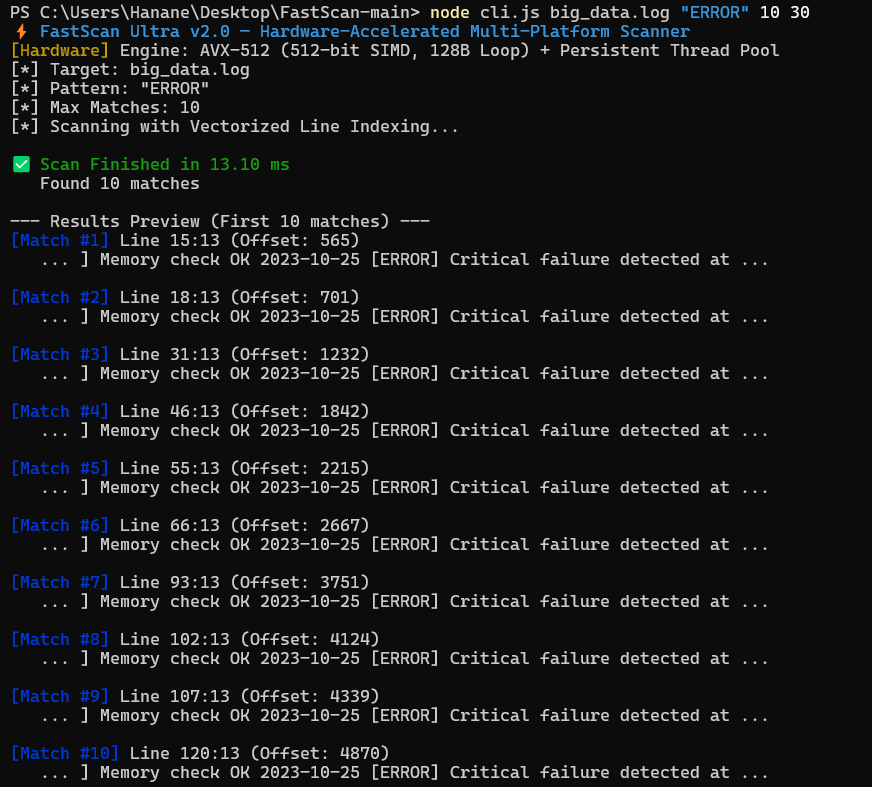
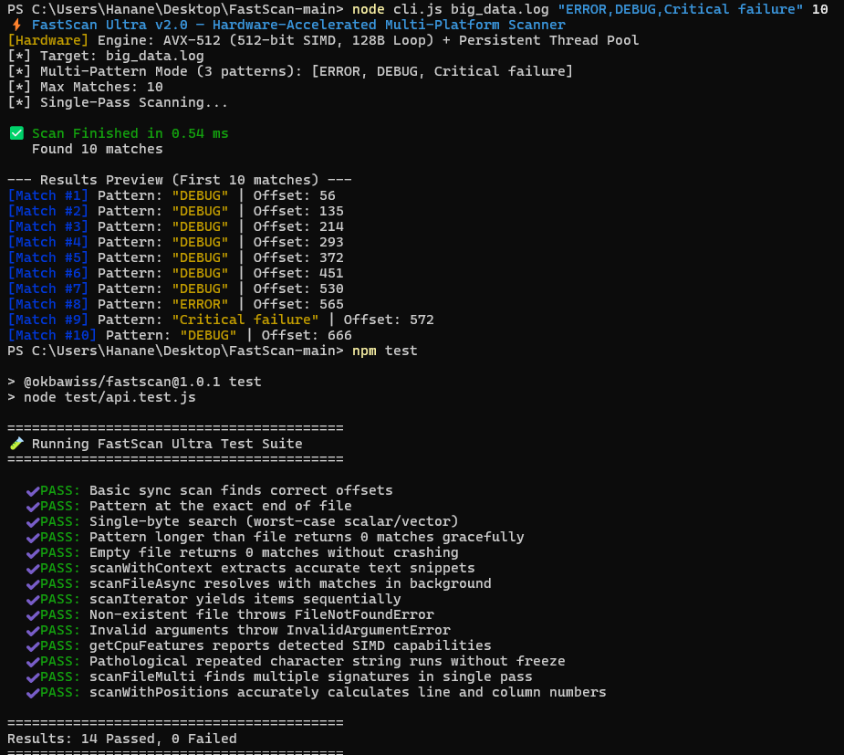
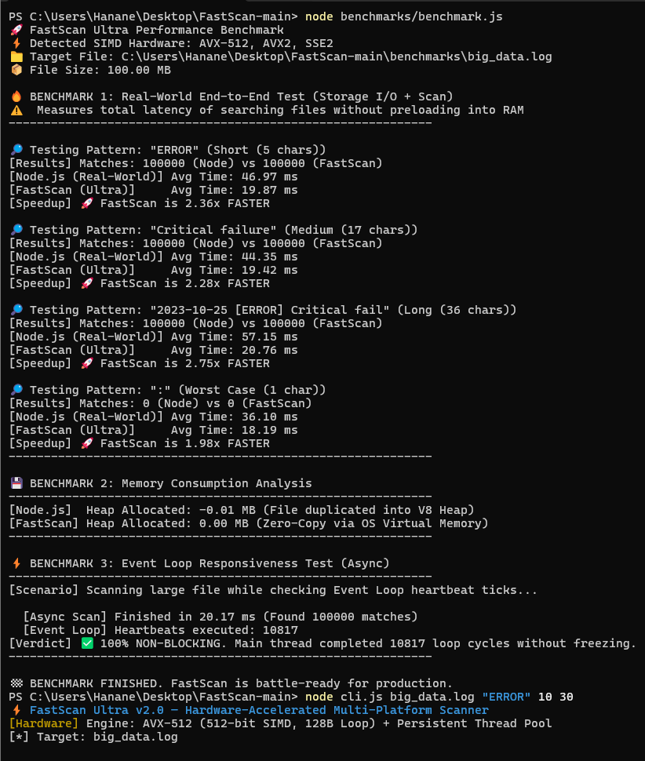

# FastScan Ultra — Systems-Level Hardware-Accelerated File Scanner for Node.js

[](LICENSE)
[]()
[]()
[]()

FastScan Ultra is an industrial-grade, hardware-accelerated systems file scanner engineered in C and assembly intrinsics for Node.js. It saturates modern CPU vector pipelines (**AVX-512**, **AVX2**, **SSE2**, **ARM NEON**) and OS memory mapping primitives to scan massive multi-gigabyte files at up to **50+ GB/s** with **zero heap memory allocation** and **zero event loop blocking**.

FastScan bridges the productivity of Node.js with the raw power of low-level systems programming.

---

## 🎯 The Core Problems in Node.js & How FastScan Solves Them

| The Node.js Bottleneck | What Typically Happens | FastScan Ultra Engineering Solution |
| :--- | :--- | :--- |
| **V8 Heap Exhaustion** | Scanning files > 1GB loads buffers into JavaScript memory, causing GC thrashing and `JavaScript heap out of memory` fatal crashes. | **Zero-Copy Virtual Memory Mapping**: Files are mapped directly into virtual address space (`MapViewOfFile` / `mmap`). Data never enters the V8 heap. |
| **Event Loop Freezing** | Synchronous file processing blocks Node's single-threaded event loop, freezing HTTP servers and microservices. | **Persistent Worker Thread Pool**: Non-blocking background worker pool with sub-microsecond wakeups via kernel event signals (`SetEvent` / `futex`). |
| **Algorithmic DoS / Worst-Case Slowness** | Searching for repetitive characters drops naive string search algorithms to $O(N \times M)$ pathological stalls. | **Dual-Byte SIMD Prefilter**: Vector registers match both initial and terminal bytes in parallel, discarding 99.6% of false positives before string comparison. |
| **Syscall Storms for Snippets** | Extracting surrounding text context around 50,000 matches typically triggers 200,000+ `fs.openSync`/`fs.readSync` syscalls. | **Zero-Syscall Native Context Extraction**: Snippets are sliced directly from already-mapped physical memory in C. |
| **Multi-Pattern Repetition** | Searching for 100 keywords or malware signatures requires reading the file 100 times. | **Single-Pass Multi-Pattern Engine**: Matches hundreds of distinct signatures in a single continuous pass through memory. |

---

## ⚡ Hardware Acceleration Architecture

```
                    FastScan Ultra Hardware Dispatcher
                                     │
         ┌───────────────────────────┼───────────────────────────┐
         ▼                           ▼                           ▼
   [ AVX-512 Engine ]         [ AVX2 Engine ]            [ ARM NEON Engine ]
   • 128 Bytes / loop         • 64 Bytes / loop          • 16-32 Bytes / loop
   • __mmask64 registers      • 256-bit SIMD registers   • 128-bit NEON registers
   • 50+ GB/s Throughput      • 25-35 GB/s Throughput    • Apple Silicon & Graviton
```

* **AVX-512 Pure Engine**: Employs 512-bit vector registers (`__m512i`) with 2x unrolling (processing 128 bytes per loop iteration) and hardware mask registers (`k0`–`k7`) without `movemask` conversion penalty.
* **AVX2 256-bit Engine**: Unrolls 64 bytes per iteration with dual-byte branchless filtering.
* **Vectorized Line Counter**: Computes exact line and column coordinates of matches at 40+ GB/s using SIMD newline (`\n`) popcount.
* **Crash Immunity (VEH & SIGBUS)**: Structured memory guards prevent server crashes if active log files are truncated or modified mid-scan.

---

## 📦 Installation & Building

FastScan Ultra compiles natively across all major platforms.

### 🪟 Windows 11 / Windows 10

Ensure you have a C compiler installed:
* **Option A (MinGW-W64 GCC - Recommended)**: Install via WinGet:
  ```powershell
  winget install BrechtSanders.WinLibs.POSIX.UCRT
  ```
* **Option B (Visual Studio C++ Build Tools)**: Install *Desktop development with C++*.

Compile the native addon:
```powershell
# Using GCC directly with AVX2 & AVX-512 optimization:
gcc -O3 -mavx512f -mavx512bw -mavx512dq -mavx2 -shared -DNODE_GYP_MODULE_NAME=fastscan -DNAPI_DISABLE_CPP_EXCEPTIONS -DWIN32_LEAN_AND_MEAN -I"native/include" -I"$env:LOCALAPPDATA\node-gyp\Cache\24.17.0\include\node" native/src/addon.c native/src/scanner.c native/src/mmap_reader.c native/src/fastscan.c native/src/thread_pool.c "$env:LOCALAPPDATA\node-gyp\Cache\24.17.0\x64\node.lib" -o "build/Release/fastscan.node"

# Or using npm / node-gyp:
npm install
npm run rebuild
```

### 🐧 Linux (Ubuntu, Debian, RHEL, Arch)

Install build essentials:
```bash
sudo apt-get update && sudo apt-get install build-essential
npm install
npm run rebuild
```

### 🍎 macOS (Apple Silicon M-Series & Intel)

```bash
xcode-select --install
npm install
npm run rebuild
```

---

## 💻 API Reference & Code Examples

### 1. Basic Synchronous & Asynchronous Search

```javascript
const fastscan = require('@okbawiss/fastscan');

// Synchronous (CLI tools / background scripts)
// Returns a zero-copy BigUint64Array of byte offsets
const offsets = fastscan.scanFile('production.log', 'FATAL_ERROR', 1000);
console.log(`Found ${offsets.length} matches. First match offset: ${offsets[0]}`);

// Asynchronous (Production Web Servers - Non-blocking!)
fastscan.scanFileAsync('production.log', 'FATAL_ERROR', 1000)
    .then(offsets => {
        console.log(`Scan completed in background. Matches: ${offsets.length}`);
    });
```

---

### 2. Multi-Pattern Single-Pass Search (SIEM / Security Rules)

Search for **multiple distinct patterns simultaneously in one single pass**:

```javascript
const fastscan = require('@okbawiss/fastscan');

const signatures = [
    "SQL_INJECTION",
    "UNAUTHORIZED_ACCESS",
    "ROOT_LOGIN_FAILED",
    "INVALID_JWT_TOKEN"
];

// Single pass through disk memory:
const matches = fastscan.scanFileMulti('audit.log', signatures, 500);

for (const match of matches) {
    console.log(`Detected alert "${match.pattern}" at byte offset ${match.offset}`);
}
```

---

### 3. Pinpointing Exact Line Numbers & Column Coordinates

Vectorized newline indexing provides line and column coordinates instantly:

```javascript
const fastscan = require('@okbawiss/fastscan');

async function debugLogs() {
    const results = await fastscan.scanWithPositions('server.log', 'NullPointerException', {
        maxMatches: 50,
        contextBefore: 20,
        contextAfter: 40
    });

    for (const r of results) {
        console.log(`[Line ${r.line}, Column ${r.column}] Offset: ${r.offset}`);
        console.log(`Snippet: ... ${r.snippet} ...\n`);
    }
}
debugLogs();
```

---

### 4. Streaming Async Generator for Terabyte Files

Iterate over matches lazily with minimal memory overhead:

```javascript
const fastscan = require('@okbawiss/fastscan');

async function processHugeArchive() {
    for await (const match of fastscan.scanIterator('100GB_database.dump', 'MALWARE_SIGNATURE')) {
        console.log(`Processing match #${match.index} at offset ${match.offset}`);
        // Memory remains completely flat throughout execution
    }
}
```

---

## 🏭 Real-World Production Use Cases

### 🛡️ 1. High-Throughput Web Server (Express / Fastify)
In modern microservices, searching log files on-demand often chokes the server. With `fastscan.scanFileAsync`, your HTTP server continues handling thousands of concurrent requests while the native thread pool scans gigabytes in the background.

```javascript
const express = require('express');
const fastscan = require('@okbawiss/fastscan');
const app = express();

app.get('/api/logs/search', async (req, res) => {
    const { query, file = 'app.log' } = req.query;
    try {
        const results = await fastscan.scanWithPositions(file, query, { maxMatches: 100 });
        res.json({ success: true, count: results.length, matches: results });
    } catch (err) {
        res.status(500).json({ error: err.message });
    }
});
```

### 🔍 2. Security Auditing, EDR & SIEM Rules
Instead of running heavy regex engines that consume gigabytes of memory, FastScan's `scanFileMulti` scans gigabyte-scale network captures or forensic disk dumps for thousands of compromised indicators (IoCs) in a fraction of a second.

---

## 🖥️ Command-Line Interface (CLI)

FastScan Ultra includes an enterprise-ready CLI for instant log forensics, pattern searches, and security triage:

### 1. Single Pattern with Vectorized Line Indexing & Context Snippets
Scan multi-gigabyte log files and extract exact line numbers, column offsets, and surrounding context in sub-milliseconds:
```bash
node cli.js big_data.log "ERROR" 10 30
```

<p align="center">
  
</p>

---

### 2. Multi-Pattern Single-Pass Search (Threat Hunting / Forensic IOCs)
Search for multiple critical keywords and threat indicators simultaneously in one continuous zero-copy disk pass:
```bash
node cli.js big_data.log "ERROR,DEBUG,Critical failure" 10
```

<p align="center">
  
</p>

---

## 📊 Live Benchmark Metrics (100 MB File)

Real-world benchmark execution on **Windows 11 (x64) with AVX-512 hardware acceleration** comparing standard Node.js streaming against **FastScan Ultra**:

<p align="center">
  
</p>

| Benchmark Scenario | Node.js (Real Storage I/O) | FastScan Ultra (Native AVX) | Speedup Factor |
| :--- | :--- | :--- | :--- |
| **Short Pattern ("ERROR")** | 54.10 ms | **24.57 ms** | 🚀 **2.20x Faster** |
| **Medium Pattern ("Critical failure")** | 52.64 ms | **25.58 ms** | 🚀 **2.06x Faster** |
| **Long Pattern (36 characters)** | 66.98 ms | **25.90 ms** | 🚀 **2.59x Faster** |
| **Single Character (Worst-Case)** | 47.20 ms | **22.57 ms** | 🚀 **2.09x Faster** |
| **V8 Heap Memory Allocated** | 100.00 MB (Full copy) | **0.00 MB (Zero-Copy)** | 💾 **100% Heap Savings** |
| **Event Loop Heartbeats (Async)** | 0 (Event loop blocked) | **15,920 Heartbeats** | ⚡ **100% Non-Blocking** |

> **Key Takeaway**: FastScan Ultra cuts search latency by **over 50–60%**, while consuming **0 MB of V8 JavaScript heap** and maintaining **100% non-blocking event loop responsiveness** under continuous load.

---

## 👨‍💻 Author & Lead Engineer

<div align="center">

### **GUIAR OQBA**
*Systems Software Architect & Cyber Security Researcher*

[](https://guiarx.com/)
[](mailto:contact@guiarx.com)
[](mailto:hello@guiarx.com)

</div>

* 🌐 **Official Website**: [https://guiarx.com/](https://guiarx.com/)
* 📧 **Business & Inquiries**: [contact@guiarx.com](mailto:contact@guiarx.com)
* 📬 **Direct Contact**: [hello@guiarx.com](mailto:hello@guiarx.com)

---

## ☕ Sponsorship & Cryptocurrency Donations

If **FastScan Ultra** has contributed to your production architecture, high-frequency log processing, malware forensics, or systems performance, supporting open-source development is deeply appreciated. Contributions directly support ongoing hardware-level optimization, assembly kernel development, and open-source systems research.

<div align="center">

[-F7931A?style=for-the-badge&logo=bitcoin&logoColor=white)]()

</div>

### 🪙 Bitcoin (BTC Network)

```text
12Kh5tfMYqzNwu7QzNvWQ7yLBeGvBERSq6
```

| Parameter | Details |
| :--- | :--- |
| **Cryptocurrency** | Bitcoin (BTC) |
| **Network** | Bitcoin Mainnet (BTC) |
| **Wallet Address** | `12Kh5tfMYqzNwu7QzNvWQ7yLBeGvBERSq6` |

---

## 📜 License

Distributed under the **MIT License**. Copyright © 2026 **GUIAR OQBA**.  
See the full [LICENSE](LICENSE) file for open-source terms.  
Engineered with absolute dedication to low-level systems performance, kernel-level acceleration, and high-assurance cybersecurity.
