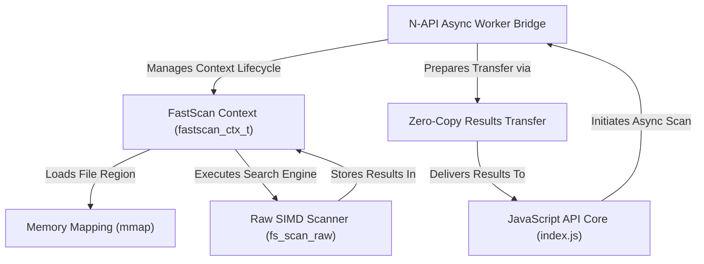
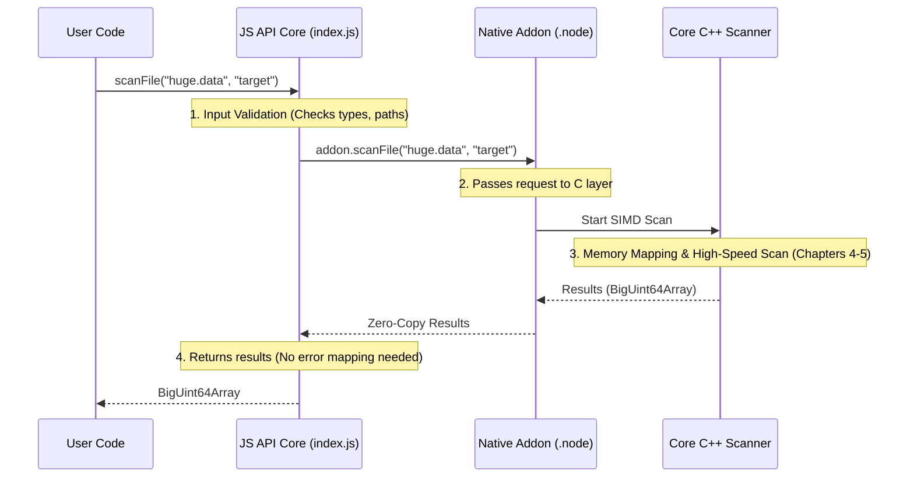
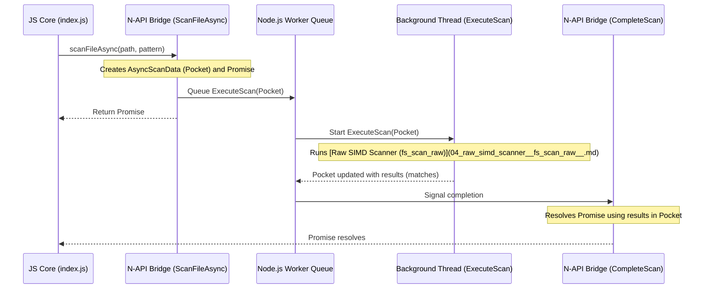
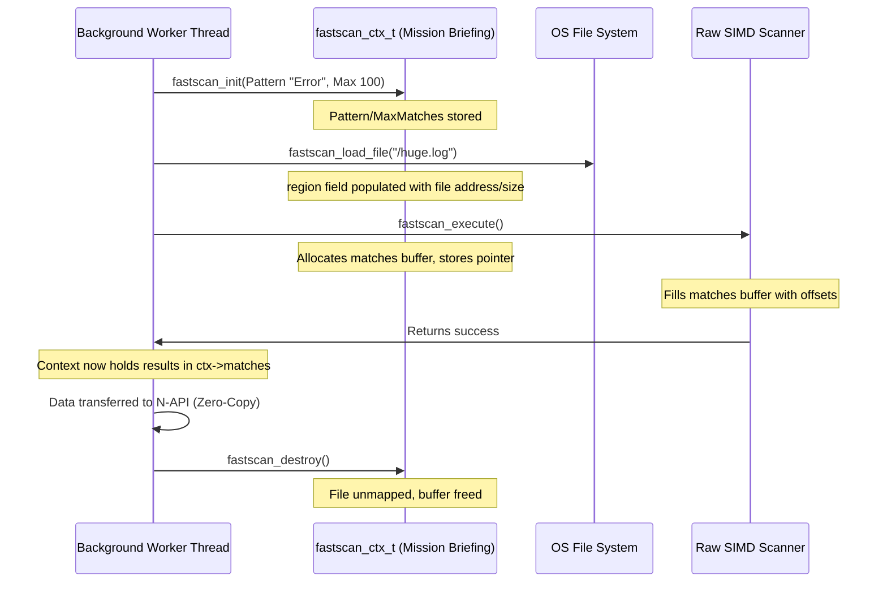
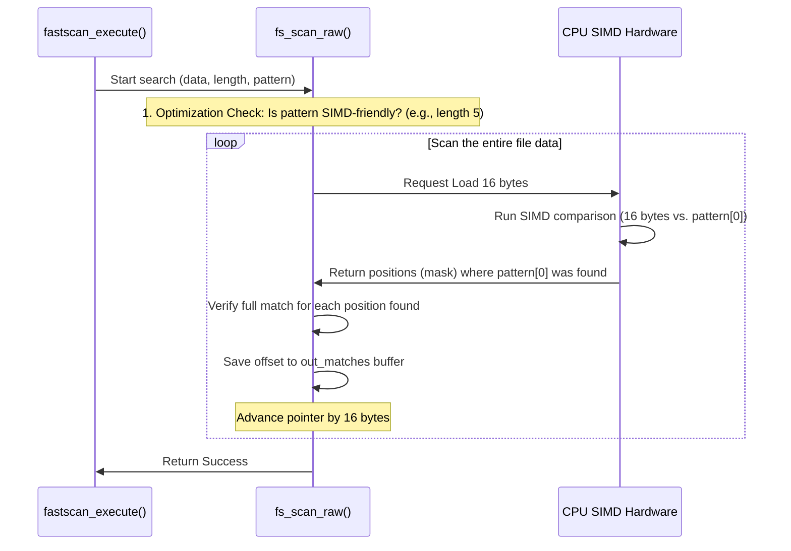
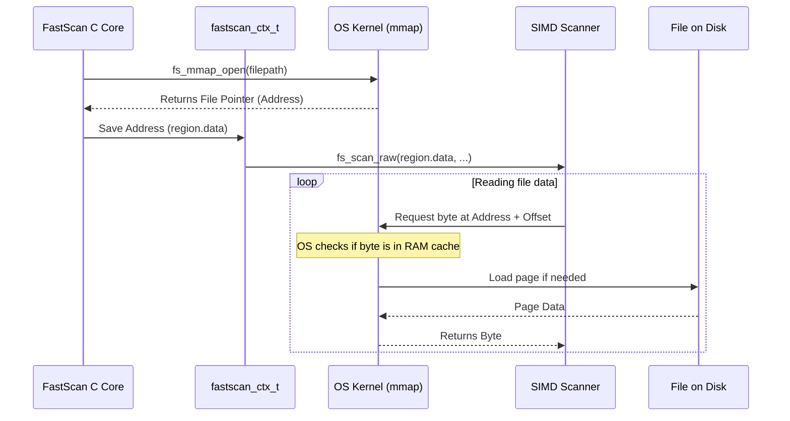

# Tutorial: FastScan

FastScan is a **high-performance** Node.js library designed to search *massive files* (GB-scale logs) efficiently. It achieves speed by utilizing **SIMD acceleration** and multi-threading in the C core, while minimizing memory overhead by using **memory mapping (mmap)** instead of loading data onto the V8 heap. Crucially, it uses an *asynchronous worker model* to keep the Node.js event loop non-blocking, and returns results with **zero-copy** transfers.


## Visual Overview



## Chapters

1. [JavaScript API Core (index.js)
](01_javascript_api_core__index_js__.md)
2. [N-API Async Worker Bridge
](02_n_api_async_worker_bridge_.md)
3. [FastScan Context (fastscan_ctx_t)
](03_fastscan_context__fastscan_ctx_t__.md)
4. [Raw SIMD Scanner (fs_scan_raw)
](04_raw_simd_scanner__fs_scan_raw__.md)
5. [Memory Mapping (mmap)
](05_memory_mapping__mmap__.md)
6. [Zero-Copy Results Transfer
](06_zero_copy_results_transfer_.md)

---


# Chapter 1: JavaScript API Core (index.js)

Welcome to the internal workings of FastScan! Since FastScan is built on incredibly fast C/C++ code, we need a friendly face in JavaScript to manage all that power.

The file `src/index.js` is the "front door" of the entire library. When you install FastScan and type `require('fastscan')`, you are loading the code that lives in `index.js`.

## Motivation: The Need for a JavaScript Core

Why can't we just call the super-fast C functions directly?

Imagine the core C code is a rocket engine—powerful, but potentially dangerous if misused. The JavaScript API Core (`index.js`) serves as that control panel. It ensures safety and convenience before and after the native code runs.

Its main jobs are:

1.  **Safety First (Input Validation):** Making sure the inputs (like file paths or search patterns) are valid before passing them to the native C layer, preventing Node.js crashes.
2.  **Convenience (Sync vs. Async):** Providing both synchronous (`scanFile`) and asynchronous (`scanFileAsync`) versions of the scanner.
3.  **Clarity (Error Mapping):** Converting cryptic, low-level error messages returned by the C engine (e.g., "File not found") into readable, structured JavaScript Error classes (like `FileNotFoundError`).

## The User's Perspective: Core Scanning Functions

FastScan provides two main functions for scanning files, both exported directly from `index.js`. They perform the exact same fast scan, but differ in how they interact with Node.js's single-threaded nature:

| Function | Type | Blocks Event Loop? | Best Used For |
| :--- | :--- | :--- | :--- |
| `scanFile` | Synchronous | Yes | Command Line Tools (CLI) or startup scripts where blocking is acceptable. |
| `scanFileAsync` | Asynchronous | No | Web Servers (Node.js backend) where staying responsive is critical. |

#### Example Usage

Here is how a user interacts with the synchronous function, which calls the native addon under the hood:

```javascript
const fastscan = require('fastscan');

// Synchronous Example
try {
    const offsets = fastscan.scanFile('/path/to/data.log', 'critical error', 10);
    
    // offsets is a special, efficient array (BigUint64Array)
    console.log(`Found ${offsets.length} matches.`); 
} catch (e) {
    // This catches our custom, mapped errors!
    console.error("Scan failed:", e.message);
}
```

The asynchronous version, `scanFileAsync`, returns a Promise:

```javascript
const fastscan = require('fastscan');

// Asynchronous Example
fastscan.scanFileAsync('/path/to/data.log', 'warning', 50)
    .then(offsets => {
        console.log(`Async found ${offsets.length} matches.`);
    })
    .catch(e => {
        console.error("Async scan failed:", e.message);
    });
```

## Internal Magic Part 1: Input Validation

Before calling the native C addon, the JavaScript core needs to ensure the arguments are correct. If we passed invalid input (like a non-string pattern) directly to the C code, Node.js might crash entirely.

The `validate` function in `src/index.js` performs these fast, critical checks:

```javascript
// src/index.js: The 'validate' helper

const { InvalidArgumentError } = require('./errors');

function validate(filepath, pattern, maxMatches) {
    if (!filepath || typeof filepath !== 'string') {
        throw new InvalidArgumentError('Filepath must be a string');
    }
    if (!pattern || typeof pattern !== 'string') {
        throw new InvalidArgumentError('Pattern must be a string');
    }
    // Checks for maxMatches continue...
}
```

By performing validation immediately, we throw a friendly `InvalidArgumentError` (defined in `src/errors.js`) and stop execution safely *before* we ever touch the native C layer.

## Internal Magic Part 2: Error Mapping

The second crucial job of `index.js` is making error messages meaningful.

When the native C addon fails (for instance, if it runs out of memory while trying to map the file), it throws a simple error string back into JavaScript, like `"Memory mapping failed"`.

The JavaScript core converts these generic strings into specific error classes.

First, we set up a simple lookup table (`ERROR_MAP`):

```javascript
// src/index.js: Mapping C strings to JS Error Classes

const { 
    FileNotFoundError, 
    MappingError,
    // ...
} = require('./errors');

const ERROR_MAP = {
    'File not found': FileNotFoundError,
    'Memory mapping failed': MappingError,
    'Buffer allocation failed': MemoryError
};
```

Then, we wrap the native call in a `try...catch` block. When an error is caught, we check the original C error message against our map:

```javascript
// src/index.js: Error Enhancement

function scanFile(filepath, pattern, maxMatches = 100000) {
    validate(filepath, pattern, maxMatches);
    
    try {
        const result = addon.scanFile(filepath, pattern, maxMatches);
        return result;
    } catch (err) {
        // Look up the appropriate JavaScript Error Class
        const ErrorClass = ERROR_MAP[err.message] || FastScanError;
        
        // Throw the new, structured error (e.g., FileNotFoundError)
        throw new ErrorClass(err.message);
    }
}
```

This error mapping ensures that developers using FastScan receive structured errors, allowing them to use reliable checks like `if (e instanceof FileNotFoundError)` to handle specific problems.

## The Complete Execution Flow

This diagram illustrates what happens inside FastScan when a user calls the synchronous `scanFile` function:



## Conclusion and Transition

The JavaScript API Core (`index.js`) is the friendly gateway to the power of FastScan's C++ core. It provides safety through validation and usability through robust error mapping, ensuring that user inputs are correct and outputs (or errors) are clear.

We also noted the existence of the asynchronous function, `scanFileAsync`. Running C++ code in a way that doesn't freeze the main Node.js process requires a special tool. That tool is the N-API Async Worker Bridge, which moves heavy tasks off the main thread.


---


# Chapter 2: N-API Async Worker Bridge

In [Chapter 1: JavaScript API Core (index.js)](01_javascript_api_core__index_js__.md), we saw how important the asynchronous function, `scanFileAsync`, is for keeping Node.js servers responsive.

But how can code written in C—a language that naturally "blocks" execution—run inside Node.js *without* freezing the main process?

The answer is the **N-API Async Worker Bridge**, located in our native code file, `native/src/addon.c`. This bridge is the specialized middleware responsible for safely moving time-consuming tasks (like scanning huge files) off the main Node.js thread.

## Motivation: Why the Main Thread Must Be Free

Node.js operates on a single execution thread, often called the **Event Loop**. This loop handles all JavaScript execution, network requests, and timers.

If we run a synchronous C function (`scanFile`) to process a 5GB file, the Event Loop stops completely for the duration of the scan. New requests cannot be handled, timers stop, and the server appears frozen.

| Scenario | Execution Location | Outcome |
| :--- | :--- | :--- |
| **Synchronous Scan** | Event Loop (Main Thread) | Node.js freezes (I/O Block) |
| **Asynchronous Scan** | **Background Worker Thread** | Event Loop stays responsive |

The Async Worker Bridge uses a feature of N-API (Node API) designed specifically to manage this background execution, allowing FastScan to be high-performance *and* server-friendly.

## The Core Abstraction: `napi_async_work`

The N-API Async Worker mechanism acts like a task manager that guarantees our heavy C code runs on a separate thread pool managed by Node.js.

The lifecycle of an asynchronous scan is broken down into three distinct, non-overlapping phases:

| Phase | N-API Function | Execution Location | Purpose |
| :--- | :--- | :--- | :--- |
| **1. Preparation** | `ScanFileAsync` | Main Thread | Receives JS input, sets up promise. |
| **2. Execution** | `ExecuteScan` | Background Worker | Runs the heavy C scanning logic. |
| **3. Completion** | `CompleteScan` | Main Thread | Resolves or rejects the JavaScript Promise. |

Notice that only Phase 2, the long, blocking file scan, occurs outside the main thread. This separation is the key to FastScan’s speed and stability.

## Phase 1: Preparation (The Data Pocket)

When a user calls `scanFileAsync`, the C function `ScanFileAsync` runs immediately on the main thread. Its job is to collect the inputs and set up the infrastructure for the background worker.

### The `AsyncScanData` Structure

We need a safe way to move data (like the file path and pattern) *from* the main thread *to* the background thread, and then the results back. We use a C structure called `AsyncScanData` for this "Data Pocket":

```c
// native/src/addon.c: The Data Pocket
typedef struct {
    napi_async_work work;
    napi_deferred deferred; // Promise resolver
    char file_path[1024];   // Input: File to scan
    fs_size_t* matches;     // Output: The scan results
    fs_status_t scan_status;// Output: Success or error code
} AsyncScanData;
```

This struct is allocated on the C heap (using `malloc`), and its lifetime spans all three phases.

### Setting up the Promise and Work

The `ScanFileAsync` function takes the inputs, copies them into the `AsyncScanData` struct, creates a Promise, and then queues the work.

```c
// In addon.c: ScanFileAsync (Simplified setup)
static napi_value ScanFileAsync(napi_env env, napi_callback_info info) {
    // 1. Allocate and populate async_data struct
    AsyncScanData* async_data = (AsyncScanData*)malloc(...);
    // ... copy JS arguments into async_data ...

    // 2. Create the JS Promise, store resolver in 'deferred'
    napi_value promise;
    napi_create_promise(env, &async_data->deferred, &promise);

    // 3. Create the work object, linking it to our functions
    napi_create_async_work(
        env, NULL, /* resource_name */, 
        ExecuteScan, CompleteScan, async_data, &async_data->work
    );

    // 4. Send the task to the background queue
    napi_queue_async_work(env, async_data->work);

    return promise; // Return the JS Promise immediately
}
```

By returning the `promise` immediately, the Node.js Event Loop remains free, and the user's JavaScript execution continues without blocking.

## The Execution Flow

This diagram illustrates how the `AsyncScanData` pocket travels through the system:



## Phase 2: Execution (`ExecuteScan`)

The `ExecuteScan` function is the core of the heavy lifting. It is executed entirely in a background worker thread.

Crucially, **we cannot use any N-API or V8 functions here**, as those rely on the main thread environment (`env`). The only arguments available are the `AsyncScanData` struct (our pocket) and a generic environment pointer (which is usually ignored here).

```c
// In addon.c: ExecuteScan function (Background Worker Thread)
static void ExecuteScan(napi_env env, void* data) {
    AsyncScanData* async_data = (AsyncScanData*)data;
    fastscan_ctx_t ctx = {0};

    // 1. Initialize scanner context
    fastscan_init(&ctx, async_data->pattern, async_data->max_matches);

    // 2. Blocking I/O starts here (mmap file)
    fastscan_load_file(&ctx, async_data->file_path);
    
    // 3. Run the high-speed scan
    fastscan_execute(&ctx);

    // 4. Store results in the AsyncScanData pocket
    async_data->matches = ctx.matches;
    async_data->match_count = ctx.match_count;
    // ... clean up file mapping ...
}
```
This function is where the C layer initializes the core context (covered in [Chapter 3: FastScan Context (fastscan_ctx_t)](03_fastscan_context__fastscan_ctx_t__.md)), reads the file using [Memory Mapping (mmap)](05_memory_mapping__mmap__.md), and performs the scan. Once complete, it saves the `matches` array pointer and the status code back into the `AsyncScanData`.

## Phase 3: Completion (`CompleteScan`)

Once `ExecuteScan` finishes, Node.js automatically queues `CompleteScan` to run back on the **main thread**. This is where we safely transition back into JavaScript, using the `napi_env` (environment) pointer again.

### Handling Results and Errors

The `CompleteScan` function inspects the `scan_status` saved in the data pocket:

1.  **If `FS_SUCCESS`:** We must resolve the promise with the results. This involves the zero-copy transfer process (which will be detailed in [Chapter 6: Zero-Copy Results Transfer](06_zero_copy_results_transfer_.md)).
2.  **If Error:** We map the C status code (e.g., `FS_ERROR_OPEN_FAILED`) to a human-readable string and reject the promise.

```c
// In addon.c: CompleteScan function (Main Thread)
static void CompleteScan(napi_env env, napi_status status, void* data) {
    AsyncScanData* async_data = (AsyncScanData*)data;

    if (async_data->scan_status != FS_SUCCESS) {
        // Error case: Map status code to string and reject promise
        napi_value error_msg;
        // ... mapping logic ...
        napi_reject_deferred(env, async_data->deferred, error_msg);
    } else {
        // Success case: Create JS typed array from C memory
        napi_value js_result_array;
        // ... Zero-copy logic to create js_result_array ...
        napi_resolve_deferred(env, async_data->deferred, js_result_array);
    }
    
    // Always clean up the N-API work object and the data pocket
    napi_delete_async_work(env, async_data->work);
    free(async_data);
}
```

This final step ensures that regardless of success or failure, all C resources associated with the asynchronous job are cleaned up, and the JavaScript Promise receives its final status.

## Summary and Transition

The N-API Async Worker Bridge is the crucial link that transforms FastScan’s powerful, blocking C code into a responsive, idiomatic Node.js library. It achieves this by using the `napi_async_work` mechanism to manage the transition of inputs and outputs between the main thread (JS/Promise handling) and a background thread (C/SIMD scanning).

Now that we understand how the work is scheduled, we need to look at the internal data structure that manages the scanning operation itself. This structure, which holds the pattern, the file mapping, and the results buffer, is the FastScan Context.


---


# Chapter 3: FastScan Context (`fastscan_ctx_t`)

In [Chapter 2: N-API Async Worker Bridge](02_n_api_async_worker_bridge_.md), we learned that when you call `scanFileAsync`, the work is safely handed off to a background worker thread.

Now that the thread has been created, it needs a clear set of instructions—a mission briefing—to perform the high-speed scan. It needs to know:
1. What file to look at.
2. What specific sequence of bytes to find.
3. Where to write the results.

This centralized, self-contained control panel for a single scan operation is the **FastScan Context**, defined by the structure `fastscan_ctx_t`.

## Motivation: The Central Briefing File

Think of every file scan as a separate mission. If we didn't use a central context structure, every function (`fastscan_init`, `fastscan_load_file`, `fastscan_execute`) would need to pass 5 or 6 arguments back and forth: file pointer, pattern length, maximum results, current count, etc. This is messy and error-prone.

The `fastscan_ctx_t` solves this by packaging everything related to one scan into a single structure.

> **Analogy:** The `fastscan_ctx_t` is like the clipboard carried by the search team leader. It contains the map (file data), the target description (pattern), and the result spreadsheet (matches buffer). This clipboard guarantees the entire operation is isolated and safe, even if 10 other search teams are running parallel missions.

## Anatomy of the Context Object

The `fastscan_ctx_t` is a C structure that holds three categories of information: Input, State (File Data), and Output.

### 1. The Inputs

These are the parameters provided by the JavaScript user, translated into C variables:

| Context Field | Purpose |
| :--- | :--- |
| `pattern` | Pointer to the string/bytes we are searching for. |
| `pattern_len` | The length of the pattern (e.g., 6 bytes for "search"). |
| `max_matches` | The maximum number of results the user requested. |

### 2. The File Data State (`fs_region_t`)

The context must know where the file is loaded in memory. This is managed by a nested structure called `fs_region_t`. We will dive deep into how this works in [Chapter 5: Memory Mapping (mmap)](05_memory_mapping__mmap__.md).

```c
// native/include/fastscan.h (Nested structure)
typedef struct {
    const fs_byte_t* data; // The starting memory address of the file
    fs_size_t size;        // The total size of the file (in bytes)
    int fd;                // The file descriptor (ID used by the OS)
} fs_region_t;
```
The main context holds one of these: `fs_region_t region;`.

### 3. The Outputs and Results

These fields manage where the final byte offsets are stored:

| Context Field | Purpose |
| :--- | :--- |
| `matches` | A pointer to a heap-allocated buffer (`fs_size_t*`) where the results (byte offsets) are written during the scan. |
| `match_count` | The final total number of matches found by the scanner. |

## The Context Lifecycle: Initialization and Destruction

A single scan task is defined by three main functions, all centered around managing the `fastscan_ctx_t` object:

### Phase 1: Setup (`fastscan_init`)

This function cleans up the structure and populates the input fields.

```c
// native/src/fastscan.c: Initialization
fs_status_t fastscan_init(fastscan_ctx_t* ctx, 
                          const char* pattern, 
                          fs_size_t max_results) {
    
    // 1. Ensure the memory is zeroed out first
    memset(ctx, 0, sizeof(fastscan_ctx_t));
    
    // 2. Populate input fields
    ctx->pattern = pattern;
    ctx->pattern_len = strlen(pattern);
    ctx->max_matches = max_results;
    ctx->is_initialized = 1;

    return FS_SUCCESS;
}
```

### Phase 2: Execution (`fastscan_execute`)

This is the phase where the file is loaded (via `fastscan_load_file`) and the scan runs, filling the `matches` buffer.

```c
// native/src/addon.c (Inside ExecuteScan function)
static void ExecuteScan(napi_env env, void* data) {
    // 1. Context created on the stack (cheap)
    fastscan_ctx_t ctx = {0}; 

    // 2. Initialize with inputs
    fastscan_init(&ctx, async_data->pattern, async_data->max_matches);

    // 3. Load file (populates ctx.region)
    fastscan_load_file(&ctx, async_data->file_path);
    
    // 4. Run the actual SIMD scan (populates ctx.matches)
    fastscan_execute(&ctx);

    // ... save results and clean up ...
}
```

The `fastscan_execute` function is responsible for dynamically allocating the memory buffer needed to hold the results, and saving the pointer to that buffer in `ctx->matches`. This buffer is where the search results land.

### Phase 3: Cleanup (`fastscan_destroy`)

Since the context allocates memory (for the results buffer) and opens system resources (the file mapping), it must be properly cleaned up, regardless of whether the scan succeeds or fails.

```c
// native/src/fastscan.c: Destruction
void fastscan_destroy(fastscan_ctx_t* ctx) {
    if (!ctx) return;

    // 1. Unmap the file data
    fs_mmap_close(&ctx->region);

    // 2. Free the allocated results buffer
    if (ctx->matches) {
        free(ctx->matches);
        ctx->matches = NULL;
    }

    // Reset counters and state
    ctx->match_count = 0;
    ctx->is_initialized = 0;
}
```
This cleanup is essential for preventing memory leaks and ensuring file handles are closed immediately after the scan finishes.

## The Context in Action

The `fastscan_ctx_t` ensures that all resources required for a specific scan are linked together. This is crucial for thread safety, as seen in the asynchronous flow from the previous chapter:



## Summary and Transition

The FastScan Context (`fastscan_ctx_t`) is the singular, powerful data structure used in the native C layer to manage the entire life of a file scan. It holds the input parameters, the mapping of the file itself, and the memory buffer designated to hold the resulting byte offsets.

Once the context is initialized and the file is loaded, the next step is the actual heavy lifting: running the raw, optimized search algorithm.

[Next Chapter: Raw SIMD Scanner (fs_scan_raw)](04_raw_simd_scanner__fs_scan_raw__.md)

---


# Chapter 4: Raw SIMD Scanner (`fs_scan_raw`)

In [Chapter 3: FastScan Context (fastscan_ctx_t)](03_fastscan_context__fastscan_ctx_t__.md), we prepared the `fastscan_ctx_t` by collecting inputs and allocating the buffer where results will be stored. We now have everything ready: the location of the file data in memory, the pattern to search for, and an empty list waiting for results.

This chapter dives into the actual engine of FastScan: the incredibly fast, low-level search function, `fs_scan_raw`. This function is responsible for the performance gains that FastScan delivers.

## Motivation: Speeding Up the Search

Imagine you need to scan a 10-Gigabyte log file for the word "ALERT".

A standard approach in C or JavaScript would be to look at the file one character at a time, checking the subsequent characters only when the first one matches. This is reliable, but slow, as the CPU spends many clock cycles just moving from one character to the next.

To achieve lightning speed, FastScan uses **SIMD** (Single Instruction, Multiple Data) instructions, which are specialized CPU features designed for parallel data processing.

### What is SIMD? The 16-Lane Highway

The core idea of SIMD is to perform the same operation on multiple pieces of data simultaneously.

Think of searching a file like checking license plates on a highway:

| Standard Search (Sequential) | SIMD Search (Parallel) |
| :--- | :--- |
| **CPU Lane:** 1 lane wide. | **CPU Lane:** 16 lanes wide. |
| **Action:** Compare 1 byte (character) at a time. | **Action:** Compare 16 bytes (characters) at a time. |
| **Speed:** Slower, requires more clock cycles per file size. | **Speed:** Up to 16x faster for the initial check. |

FastScan utilizes these 16-byte wide instructions (specifically the SSE2 instruction set used by most modern Intel/AMD CPUs) to drastically reduce the number of steps required to scan a huge file.

## The Raw Search Function: `fs_scan_raw`

The function `fs_scan_raw` found in `native/src/scanner.c` is the high-performance core.

Its job is simple: take a pointer to a chunk of memory and search it, filling the results buffer. It doesn't worry about files, Node.js, or contexts—it's pure searching logic.

Here is its simplified signature:

```c
// native/include/scanner.h (Simplified)
fs_status_t fs_scan_raw(
    const fs_byte_t* data,      // Start of the file memory block
    fs_size_t data_len,         // Total size of the memory block
    const fs_byte_t* pattern,   // The target bytes (e.g., "ERROR")
    fs_size_t pattern_len,
    fs_size_t* out_matches,     // Buffer to write offsets into
    fs_size_t* match_count,
    fs_size_t max_matches
);
```

### Flow of Execution

When the background worker thread calls this function, the search process begins:



## Diving into the SIMD Fast Path

FastScan has optimized paths for specific, common pattern lengths (like 5 or 8 bytes) because they are often used for log markers ("ERROR", "FATAL", "DEBUG"). If the pattern is not an optimized length, it falls back to a fast standard library routine (`memchr`), which is still very fast but lacks the 16-byte parallelism.

Let's look at the core idea of the SIMD path for a 5-byte pattern like "ERROR".

### Step 1: Pre-loading the First Byte

The most important step is quickly eliminating locations that *cannot* be the start of a match. We only need to check if the first character of the pattern is present.

We load the first byte of the pattern (e.g., `E`) into a special SIMD register.

```c
// native/src/scanner.c (Inside pattern_len == 5 block)
// b0_vec now holds 16 copies of the byte 'E'
const __m128i b0_vec = _mm_set1_epi8(pattern[0]); 
```

### Step 2: The Parallel Check

Inside the main loop, we load 16 consecutive bytes from the file into another register, and compare them all against `b0_vec` in a single instruction (`_mm_cmpeq_epi8`).

```c
while (start < simd_limit) {
    // 1. Load 16 bytes from memory location 'start'
    __m128i chunk = _mm_loadu_si128((const __m128i*)start);
    
    // 2. Compare the 16 bytes in 'chunk' against the 16 'E's in b0_vec
    __m128i cmp = _mm_cmpeq_epi8(chunk, b0_vec);
    
    // 3. Create a mask: a bit field (0s and 1s) showing where 'E' was found
    int mask = _mm_movemask_epi8(cmp); 
    
    // ... verification logic follows ...
    
    start += 16;
}
```

The resulting `mask` is a number where a bit is set (1) if the first character matched at that position, and zero (0) if it didn't. This single comparison replaces 16 individual checks!

### Step 3: Verification and Saving

The mask tells us *potential* matches. However, we have only checked the first byte (`E`). We still need to verify the remaining 4 bytes (`R`, `R`, `O`, `R`).

We loop through the mask, and every time we find a set bit (a potential match), we use the slower, but necessary, standard C `memcmp` (or direct byte comparison in the optimized code) to confirm the full 5-byte pattern exists. If confirmed, we save the offset.

```c
// native/src/scanner.c (Simplified verification)
while (mask != 0) {
    int offset = __builtin_ctz(mask); // Find the position of the next match
    
    // Check bytes 2, 3, 4, 5 of the pattern (the remaining 4 bytes)
    if (start[offset+1] == b1 && start[offset+2] == b2 && ...) { 
        // Full 5-byte pattern matched!
        out_matches[(*match_count)++] = (fs_size_t)((start + offset) - data);
        if (unlikely(*match_count >= max_matches)) return FS_SUCCESS;
    }
    
    mask &= mask - 1; // Clear the bit we just processed
}
```

By using SIMD to perform the initial "pre-check" for the first character, we skip comparing the full pattern for 15 out of every 16 bytes, saving massive amounts of CPU time.

## Handling the Non-SIMD Fallback

Not all patterns are optimized for SIMD (e.g., "A" or "A very long pattern").

For patterns that don't fit the optimized sizes, FastScan uses the C standard library function `memchr` to find the first byte of the pattern. `memchr` is often highly optimized by the compiler vendors themselves, making it a very strong fallback.

```c
// native/src/scanner.c (The generic fallback path)
else {
    const fs_byte_t b0 = pattern[0];
    while (start < limit) {
        // Use memchr to quickly find the next instance of the first byte (b0)
        const fs_byte_t* found = memchr(start, b0, (end - start));
        
        if (unlikely(found == NULL || found > limit)) break;

        // Verify the full pattern from the 'found' location
        if (memcmp(found, pattern, pattern_len) == 0) {
            out_matches[(*match_count)++] = (fs_size_t)(found - data);
            if (unlikely(*match_count >= max_matches)) break;
        }
        start = found + 1; // Start searching after the found byte
    }
}
```

This ensures that even when the special SIMD acceleration cannot be used, FastScan still defaults to the fastest available library routines, guaranteeing superior performance compared to standard JavaScript string searches.

## Summary and Transition

The `fs_scan_raw` function is the performance backbone of FastScan. It uses specialized CPU instructions (SIMD) to process 16 bytes of data simultaneously, dramatically speeding up the initial search for the pattern's first character. For patterns where SIMD optimization is not applied, it relies on highly optimized standard C routines.

However, none of this search magic is possible if the file is not loaded efficiently into memory first. The performance of `fs_scan_raw` relies completely on the input memory being ready and accessible. This crucial setup step is handled by **Memory Mapping**.


---


# Chapter 5: Memory Mapping (mmap)

In [Chapter 4: Raw SIMD Scanner (fs_scan_raw)](04_raw_simd_scanner__fs_scan_raw__.md), we saw how incredibly fast FastScan’s C core is at searching memory using parallel (SIMD) CPU instructions.

But this speed is only possible if the data is *ready* for the CPU to read. How do we get the contents of a massive 10 Gigabyte (GB) file ready without:
1.  **Crashing Node.js** by using up all the V8 heap memory?
2.  **Slowing down** the program by spending minutes copying 10GB of data from the disk into RAM?

The solution to handling massive files efficiently is **Memory Mapping**, or `mmap`. This is the core strategy that lets FastScan reliably scan files much larger than your computer's physical RAM.

## Motivation: Handling Gigabyte Files

Imagine you are using a standard program to read a 5GB file. The traditional approach requires the operating system (OS) to:
1.  Read the entire 5GB file block-by-block from the hard drive.
2.  Copy all 5GB into a large buffer inside the application’s memory (the C heap or the V8 heap).

This step alone can take seconds or minutes, and if your computer only has 4GB of RAM, the program will crash or slow down massively due to heavy swapping.

### The `mmap` Solution: Treating the File as RAM

Memory Mapping is a technique where the program asks the Operating System to **link a file on the disk directly into the program’s memory space.**

The OS doesn't copy the file right away. It simply promises that if the program looks at a specific memory address (a pointer), the content of the file will appear there.

> **Analogy: The Window to the File**
> Think of memory mapping as opening a giant window directly onto the file on your hard drive. Your program doesn't load the file *inside* the house (RAM); it just peers *through the window* at the data sitting outside. When your program asks for a specific section of the file (like byte 3,000,000,000), the OS quickly loads only that small section (called a "page") into RAM cache so your program can read it instantly.

## The Core Benefits of `mmap`

By using memory mapping, FastScan gains three critical advantages:

| Benefit | Description |
| :--- | :--- |
| **Zero Copying** | Eliminates the slow initial step of reading and copying the entire file into a program buffer. |
| **Minimal Memory Usage** | The program itself allocates almost no memory for the file data; the OS manages the file data using its own page cache. |
| **Scalability** | Allows scanning of files larger than the system’s physical memory (RAM), as the OS only keeps the currently accessed parts in memory. |

## The Memory Mapping Lifecycle in FastScan

The entire memory mapping operation is managed within the C structure we met earlier, the `fs_region_t`, which lives inside the `fastscan_ctx_t`.

When `fastscan_load_file` runs (as part of the background execution in [Chapter 2: N-API Async Worker Bridge](02_n_api_async_worker_bridge_.md)), it executes two core steps: opening the map and closing the map.

### Phase 1: Opening the Map (`fs_mmap_open`)

This function is located in `native/src/mmap_reader.c`. It performs the system calls necessary to establish the connection between the file and the program's memory.

```c
// native/src/mmap_reader.c (Simplified)
fs_status_t fs_mmap_open(const char* filepath, fs_region_t* region) {
    // 1. Open the file to get a File Descriptor (fd)
    int fd = open(filepath, O_RDONLY);
    if (fd == -1) return FS_ERROR_OPEN_FAILED;
    
    // 2. Get the file size (using stat)
    fs_size_t size = 0;
    // ... logic to get size ...
    
    // 3. The mmap System Call Magic
    void* map = mmap(
        NULL, size, 
        PROT_READ,   // We only need to read the data
        MAP_PRIVATE, // Changes we make won't affect the file (but we only read)
        fd, 0
    );
    if (map == MAP_FAILED) {
        close(fd);
        return FS_ERROR_MMAP_FAILED;
    }
    
    // 4. Save the results into the context region
    region->data = (const fs_byte_t*)map; // The starting pointer!
    region->size = size;
    region->fd = fd;
    
    // (We can close 'fd' now, the mapping remains)
    
    return FS_SUCCESS;
}
```

The critical output of `mmap` is the memory address (`region->data`). This address, which looks like a normal pointer in C, now points directly to the file data managed by the OS. This address is immediately passed to the [Raw SIMD Scanner (fs_scan_raw)](04_raw_simd_scanner__fs_scan_raw__.md).

### The Execution Flow

Once the map is open, the SIMD scanner can run extremely fast, accessing the data as if it were a simple array in RAM:



The key insight here is that the SIMD scanner never has to wait for disk I/O; it just asks for the memory address, and the OS handles the complex data loading behind the scenes.

### Phase 2: Closing the Map (`fs_mmap_close`)

Once the scan is finished, the connection to the file must be severed. If we forgot this step, we would leak system resources (file handles).

This is done by the `fastscan_destroy` function ([Chapter 3: FastScan Context (fastscan_ctx_t)](03_fastscan_context__fastscan_ctx_t__.md)) using the `munmap` system call.

```c
// native/src/mmap_reader.c (Simplified)
void fs_mmap_close(fs_region_t* region) {
    if (region->data && region->size > 0) {
        // Unmap the memory area
        munmap((void*)region->data, region->size);
        region->data = NULL;
    }

    if (region->fd != -1) {
        // Close the system file descriptor
        close(region->fd);
        region->fd = -1;
    }
    // Clean up all fields
    region->size = 0;
}
```

This ensures that the file is fully released back to the operating system immediately after the search completes, regardless of success or failure.

## Summary and Transition

Memory Mapping (`mmap`) is the foundation of FastScan's ability to handle huge files with low memory consumption and high speed. It eliminates slow copying by allowing the application to treat the file contents as a directly accessible memory pointer, relying on the OS page cache for efficient, on-demand data access.

Now that we know how FastScan reads the file and scans it, the final step is to understand how the results—the list of byte offsets found by the scanner—are safely and efficiently transferred back from the C memory layer to the Node.js JavaScript environment. This process is called Zero-Copy Results Transfer.


---


# Chapter 6: Zero-Copy Results Transfer

We have successfully navigated the complexities of FastScan:
1. We set up the work using the [N-API Async Worker Bridge](02_n_api_async_worker_bridge_.md).
2. We efficiently loaded the file using [Memory Mapping (mmap)](05_memory_mapping__mmap__.md).
3. The [Raw SIMD Scanner (fs_scan_raw)](04_raw_simd_scanner__fs_scan_raw__.md) ran the search and saved the results.

The final piece of the puzzle is moving the results from the fast C world back into the JavaScript world. The results exist as a simple C array of byte offsets, allocated using `malloc` on the native heap.

If we simply copied this data into a new JavaScript Array, we would waste CPU cycles and double our memory usage. This is unacceptable for a high-performance tool like FastScan.

The solution is **Zero-Copy Results Transfer**: a mechanism that allows JavaScript to use the C memory buffer directly, avoiding the copy step entirely.

## Motivation: Borrowing, Not Buying

Imagine the C core found 100,000 matches, resulting in an 800 KB buffer of offsets.

| Traditional Method (Copy) | Zero-Copy (Borrowing) |
| :--- | :--- |
| C allocates 800 KB. | C allocates 800 KB. |
| V8 allocates 800 KB. | V8 allocates **0 KB** for data. |
| C data copied to V8 data. (Slow) | V8 gets a pointer to C data. (Instant) |
| Total memory usage: 1.6 MB. | Total memory usage: 800 KB. |

Zero-Copy means FastScan hands over the physical memory block to Node.js, and Node.js promises to manage it and free it when finished.

## Key Concept 1: External ArrayBuffers

To achieve this memory hand-off, FastScan uses a specialized feature of N-API called the **External ArrayBuffer**.

In JavaScript, an `ArrayBuffer` is the fundamental container for raw binary data. We can create a JavaScript `ArrayBuffer` that doesn't actually contain memory, but instead points to memory we already allocated in C.

The C function we use for this is `napi_create_external_arraybuffer`.

```c
// native/src/addon.c (Simplified step 1)

napi_value array_buffer;

// Create an ArrayBuffer pointing to the raw C buffer (async_data->matches)
napi_create_external_arraybuffer(
    env,
    async_data->matches, // Pointer to C memory
    byte_length,         // Size of the memory block
    FreeMatchesCallback, // The cleanup function (Key Concept 2)
    NULL,
    &array_buffer
);
```

This single function call instantly creates a JavaScript object that represents our C-allocated results array. No data movement has occurred!

## Key Concept 2: The Finalizer Callback

When we transfer memory ownership from C to JavaScript, we face a crucial problem: *Who calls `free()` on the original C memory?*

In the C world, we must call `free()` ourselves. In the JavaScript world, the Garbage Collector (GC) handles cleanup. If we don't tell the GC how to clean up the external memory, we get a memory leak.

When we create an External ArrayBuffer, we must provide a function called the **Finalizer Callback** (named `FreeMatchesCallback` in FastScan).

**The Finalizer Rule:** When Node.js's Garbage Collector determines that the JavaScript `ArrayBuffer` is no longer reachable (i.e., the user stopped using the results array), it automatically executes the finalizer function.

```c
// native/src/addon.c: The finalizer function

static void FreeMatchesCallback(napi_env env, void* data, void* hint) {
    // 'data' is the pointer to the original C memory buffer
    // This function runs automatically when the JS object is GC'd
    free(data); 
}
```

This simple function ensures the memory is safely released back to the operating system *after* JavaScript is truly finished with it, completing the ownership transfer.

## Key Concept 3: The BigUint64Array View

An `ArrayBuffer` is just raw bytes. In FastScan, our results are a list of byte offsets, which must be 64-bit integers (`fs_size_t`) to handle files larger than 4GB.

To make the raw bytes useful to JavaScript, we create a specialized wrapper called a **TypedArray**. Because our offsets are 64-bit unsigned integers, we use `BigUint64Array`.

```c
// native/src/addon.c (Simplified step 2)

napi_value js_result_array;
// Create the view over the ArrayBuffer
napi_create_typedarray(
    env, 
    napi_biguint64_array, // Defines the data type (64-bit integer)
    async_data->match_count, 
    array_buffer,         // The external buffer created above
    0, 
    &js_result_array
);
```

The resulting `js_result_array` is what is returned to the user's Promise, looking exactly like a normal JavaScript array of BigInts, but backed by the native C memory.

## The Zero-Copy Flow

This diagram illustrates the transfer of ownership that occurs when the background worker finishes the scan and transitions back to the main thread:

```mermaid
sequenceDiagram
    participant CWorker as C Worker Thread
    participant CMemory as C Heap (malloc buffer)
    participant MainThread as JS Main Thread (CompleteScan)
    participant V8GC as Node.js V8 GC

    CWorker->>CMemory: 1. Allocates & Fills Buffer
    CWorker->>MainThread: Scan complete
    
    MainThread->>CMemory: 2. napi_create_external_arraybuffer(ptr, Finalizer)
    Note over MainThread: Creates BigUint64Array view
    MainThread->>V8GC: 3. ArrayBuffer/View ownership transfered
    
    Note over MainThread: C pointer is set to NULL to prevent double-free
    
    ... time passes, JS uses array ...
    
    V8GC->>V8GC: 4. GC detects JS array is unused
    V8GC->>CMemory: 5. Executes FreeMatchesCallback(ptr)
    CMemory-->>V8GC: Memory freed
```

### The Crucial Detachment

The C context structure (`fastscan_ctx_t`) has its own cleanup function, `fastscan_destroy`, which is responsible for freeing any memory it allocated. If we didn't interrupt this process, it would try to free the results buffer *before* we transferred ownership.

To ensure the C cleanup routine doesn't accidentally free the memory that JavaScript now owns, we explicitly clear the context's internal pointer right before we resolve the Promise in `CompleteScan`:

```c
// native/src/addon.c (Inside CompleteScan function)

// ... Zero-Copy creation completed ...

// DANGER: We must ensure the context cleanup doesn't free this memory!
async_data->matches = NULL; 

// Now we resolve the promise with the zero-copy array
napi_resolve_deferred(env, async_data->deferred, js_result_array);
```

By setting `async_data->matches = NULL`, we guarantee that when the worker thread is torn down, the standard C cleanup functions look at that field, see `NULL`, and skip calling `free()`, leaving the finalizer as the sole mechanism for memory cleanup.

## Summary

Zero-Copy Results Transfer is FastScan's mechanism for bridging high-performance C results into the Node.js environment without incurring performance penalties. By using N-API's `External ArrayBuffer` feature and a finalizer callback, FastScan transfers ownership of the raw C memory buffer directly to the V8 Garbage Collector.

This technique is essential for FastScan's performance, as it ensures:
1. **Speed:** Instant result transfer with no copying time.
2. **Efficiency:** Minimal memory overhead in the Node.js process.
3. **Safety:** Guaranteed cleanup of native resources by leveraging the V8 Garbage Collector.

This concludes our deep dive into the architecture of FastScan. We have explored the entire flow, from the JavaScript API and the asynchronous bridge, all the way down to SIMD scanning, memory mapping, and zero-copy results transfer.

---

<small>
Part of this tutorial was generated by AI Codebase Knowledge Builder 
<a href="https://github.com/The-Pocket/Tutorial-Codebase-Knowledge">AI Codebase Knowledge Builder</a>.  
<strong>References</strong>: 
<a href="https://github.com/okba14/FastScan/blob/1b951cce31b73030a5f2db5ec66a0fdc1da7d3c9/README.md">[1]</a>, 
<a href="https://github.com/okba14/FastScan/blob/1b951cce31b73030a5f2db5ec66a0fdc1da7d3c9/docs/architecture.md">[2]</a>, 
<a href="https://github.com/okba14/FastScan/blob/1b951cce31b73030a5f2db5ec66a0fdc1da7d3c9/docs/performance.md">[3]</a>, 
<a href="https://github.com/okba14/FastScan/blob/1b951cce31b73030a5f2db5ec66a0fdc1da7d3c9/native/src/addon.c">[4]</a>.
</small>
